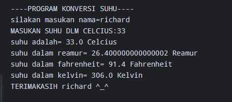

# Project Python Pertama

Program sederhana untuk mengkonversi suhu dari Celsius ke Reamur, Fahrenheit, dan Kelvin.

## Materi yang Digunakan

- input()
- float()
- variabel
- operasi aritmatika
- print()

## Konversi

- Celsius → Reamur
- Celsius → Fahrenheit
- Celsius → Kelvin

## Screenshot

